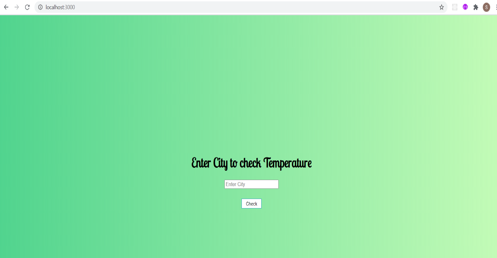
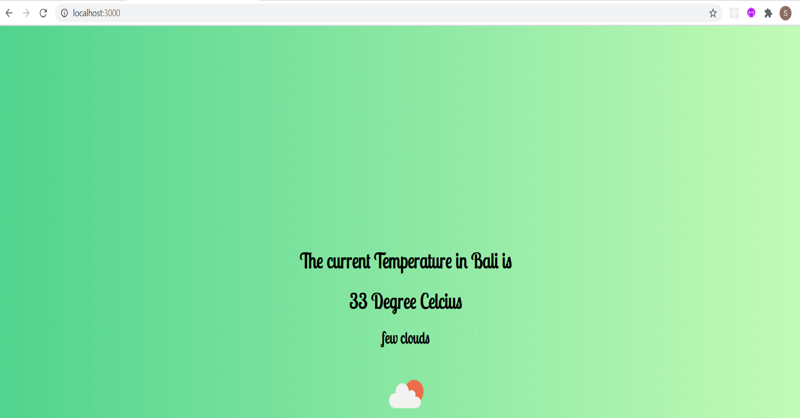

# Weather-app
A weather app using API tells the temperature of different cities.

# Weather-app
A weather app using API tells the temperature of different cities.

# To open to your local system 
install node_modules using express and run localhost:3000/

# Added Some Screenshots of the weather project

